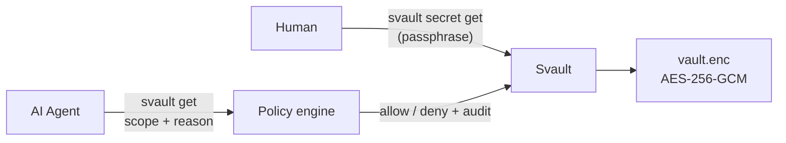
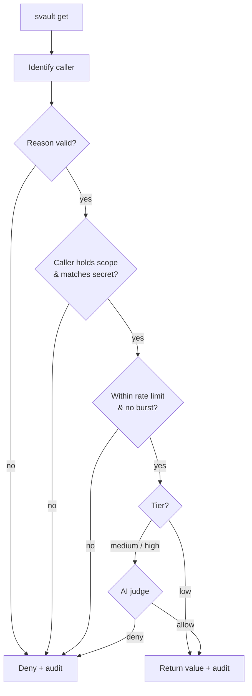
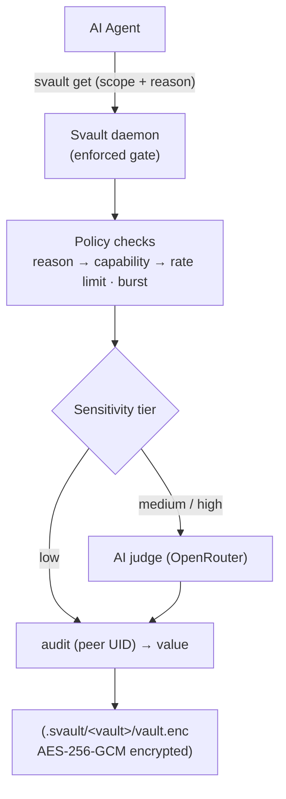

<div align="center">

# Svault

**The secret manager that knows an AI is asking.**

[](https://github.com/Soluzy/Svault/actions/workflows/lint.yml)
[](https://github.com/Soluzy/Svault/actions/workflows/ubuntu.yml)
[](https://github.com/Soluzy/Svault/actions/workflows/fedora.yml)
[](https://github.com/Soluzy/Svault/actions/workflows/macos.yml)
[](https://github.com/Soluzy/Svault/actions/workflows/windows.yml)

[](https://crates.io/crates/svault-ai)
[](https://crates.io/crates/svault-ai)
[](https://docs.rs/svault-ai)
[](LICENSE)
[](https://www.rust-lang.org)

</div>


Svault is an **AI-aware secret access layer** written in Rust. It sits between AI agents and your credentials — enforcing structured requests, detecting suspicious patterns, and making sure an agent has a real reason before it touches anything sensitive.

> **Why Svault?** Every existing secret manager (1Password, Infisical, HashiCorp Vault) treats an AI agent the same as a human or a script. Svault doesn't. It knows the difference.



---

## Documentation

| Guide | What's inside |
|---|---|
| [Installation](docs/installation.md) | crates.io, from source, supported platforms |
| [Interactive mode (TUI)](docs/tui.md) | The full-screen dashboard and keybindings |
| [Command reference](docs/commands.md) | Every subcommand and flag |
| [End-to-end walkthrough](docs/walkthrough.md) | Full flow: create → classify → judge → gated `get`, with real model output |
| [Policy engine](docs/policy-engine.md) | The agent path — `svault get`, scopes, tiers, audit |
| [Recovery & portability](docs/recovery.md) | Recovery code for a lost passphrase, export/import bundles |
| [Daemon](docs/daemon.md) | Optional Unix daemon — keys in memory, auto-lock, `daemon start/stop/status/doctor` |
| [Storage backends](docs/storage-backends.md) | Local today; cloud / self-hosted / S3 placeholders |
| [Security model](docs/security.md) | Crypto, memory safety, what's safe to commit |
| [Security review & audit](docs/security-review/) | Independent review per release + the bulletproofing process |
| [Architecture](docs/architecture.md) | How it works, on-disk layout, auth methods |
| [Roadmap](docs/roadmap.md) | Where Svault is headed |
| [Changelog](CHANGELOG.md) | What's shipped, version by version |

---

## Quick start

```bash
# Install
cargo install svault-ai

# 1. Create an encrypted vault (interactive: storage, name, agents, auto-lock,
#    default tier, AI judge). On first run you set one master passphrase — it
#    unlocks every vault. Prints a one-time recovery code — save it.
svault create

# 2. Add secrets — also classifies each one (scope + sensitivity tier) for the gate
svault secret add DB_URL --scope database --tier medium
svault secret add API_KEY --scope api --tier low

# 3. Unlock for your session — one master passphrase opens every vault
svault unlock

# 4. Use secrets without re-entering the passphrase
svault secret get DB_URL
svault secret list

# 5. Lock when done
svault lock
```

Or just run `svault` with no arguments for the [interactive TUI](docs/tui.md).

---

<details>
<summary><b>Interactive mode (TUI)</b></summary>

<br>

Run `svault` with no subcommand to open the full-screen terminal UI:

```bash
svault
```

Browse all vaults (with live lock state), `c` create, `u` unlock / `l` lock, `s` edit settings, `shift-J` manage the AI judges (create or unlock the keyring, toggle the global on/off switch, add/edit/view judges with their model/thresholds/criteria, set the default judge, set/clear a judge's API key, live test, remove a judge), and — once a vault is unlocked — `a` add, `c` classify (tier/scope/reason/description), view, and `d` delete secrets, with each secret's classification shown inline. The TUI reuses the cached session key, so an unlocked vault is never re-prompted. Every subcommand still works for scripting.

**Full keybindings → [docs/tui.md](docs/tui.md)**

</details>

<details>
<summary><b>Policy engine — the agent path</b></summary>

<br>

`svault secret get` is the **human path** — passphrase, no questions asked. `svault get` is the **agent path**: a structured request that an AI must justify, **enforced inside the daemon** that holds the key — not advisory. There is no unguarded read path, and every decision is audited with the connecting process's peer UID.

```bash
svault get DB_URL --scope database --reason "run nightly migration" --caller claude-code
```



**The AI judge.** For medium/high-tier secrets, Svault asks a fast LLM — via your OpenRouter account — whether the stated *reason* plausibly justifies the request. This is the behavioural gate that makes Svault AI-aware. You can define **multiple named judges**, each with its own model, thresholds, and free-text **criteria**, pick a default, and assign one per vault.

Everything that gates access is **AES-256-GCM encrypted at rest** — per-secret classification (scope/tier + an optional description the judge weighs against the reason) and caller rules live inside `vault.enc`; the judge registry and its API keys live in a separate encrypted **keyring** (`.svault/keyring.enc`). There are no plaintext config or key files. Because the policy is unreadable at rest, an agent can't study it to craft a passing request — and a denied `svault get` returns only a **generic** message, with the real reason recorded in the audit log for you.

```bash
svault keyring init          # create the encrypted keyring (one-time)
svault judge add reviewer    # name a judge: model, thresholds, criteria, key
svault judge enable          # turn the judge on globally
```

**Full pipeline, tiers, judge setup → [docs/policy-engine.md](docs/policy-engine.md)**

</details>

<details>
<summary><b>Recovery & portability</b></summary>

<br>

`svault create` prints a one-time **recovery code** — a 160-bit second keyslot into the vault, used if you lose the master passphrase. It's shown once and never stored in plaintext; keep it in a password manager.

```bash
svault recover                       # enter the code, re-attach the vault to your master
svault export myvault --out vault.json   # portable, checksummed encrypted bundle
svault import vault.json                 # restore on another machine
```

The bundle carries no machine-specific state and every byte is encrypted or signed — safe to move between machines (same major Svault version).

**Recovery code + export/import → [docs/recovery.md](docs/recovery.md)**

</details>

<details>
<summary><b>Storage backends</b></summary>

<br>

| Backend | Status |
|---|---|
| `local` | Available (default) |
| `cloud` | Coming soon — Soluzy SaaS |
| `self-hosted` | Coming soon — your own server |
| `s3` | Coming soon — S3 / MinIO |

The chosen backend is recorded in `meta.yaml` and shown as a `storage:name` prefix everywhere a vault is listed. Vault names must be unique.

**Details → [docs/storage-backends.md](docs/storage-backends.md)**

</details>

<details>
<summary><b>Security model</b></summary>

<br>

| Property | Implementation |
|---|---|
| Encryption | AES-256-GCM (authenticated) |
| Key derivation | Argon2id (64 MB, 3 iterations) — GPU-resistant |
| Unlock | One **master passphrase** wraps a random per-vault data key (keyslot model) — unlock once, every vault opens |
| Policy & judge config | Encrypted at rest — the policy in `vault.enc`, the judge registry + API keys in `keyring.enc`. No plaintext config or key files |
| Metadata integrity | HMAC-SHA256 — tampering with the public `meta.yaml` is detected |
| Memory safety | `VaultKey` + secrets derive `ZeroizeOnDrop` — wiped on drop |
| Session / on-disk files | Owner-only (`0600`), written atomically |
| Vault file | Safe to commit — encrypted at rest, useless without the master passphrase |

**One master passphrase is the only key you type** — it wraps each vault's random
data key, so unlocking once opens everything. The recovery code is a second
keyslot into a vault if you lose the master.

**Threat model + on-disk layout → [docs/security.md](docs/security.md)**

Every `0.x.0` release goes through an **independent security review + bulletproofing pass** — see [docs/security-review/](docs/security-review/).

</details>

<details>
<summary><b>Architecture</b></summary>

<br>



**Enforced-engine details, full layout → [docs/architecture.md](docs/architecture.md)**

</details>

---

## Roadmap

| Milestone | Status | What |
|---|---|---|
| **Foundation** | Shipped | Local AES-256-GCM vaults (Argon2id), the interactive Ratatui TUI, recovery code + encrypted export/import, and the Unix daemon (keys in memory, auto-lock) |
| **Enforced policy + AI judge** | Shipped | Daemon-enforced policy engine (peer-UID-audited) — reason, scopes, tiers, rate limit, burst — plus the AI judge (OpenRouter) gating medium/high-tier secrets |
| **Everything encrypted at rest** | Shipped | The whole policy surface in `vault.enc` and all global config + the judge registry (multiple named judges, with API keys) in `keyring.enc` — nothing abusable in plaintext; per-vault judge assignment; generic caller-facing denials |
| **Unified unlock** | Shipped (0.9.4 – 0.9.5) | One master passphrase wraps a random data key per store (keyslot model); per-vault passphrases removed (0.9.4) and the keyring brought under the master too (0.9.5); `svault master init / rekey / status` |
| **YubiKey keyslot** | Next (0.9.6) | A YubiKey HMAC-SHA1 touch as an equally-easy alternative unlock — another keyslot over the same key, so either the master passphrase or a touch opens everything (not 2FA) |
| **Conditional access + escalation** | Planned | Time-window / caller conditions in the encrypted policy; brute-force / anomaly seals a secret and escalates to a human (agents never self-clear) |
| **Local MCP** | Planned | `svault mcp` over the daemon socket (auth = same-UID + daemon-unlocked), `svault install`, and an agent capability descriptor that advertises the request interface, not the decision criteria |
| **1.0.0** | Target | A final independent review of the full agent-ready surface and install channels (script, Homebrew, Docker), then the first stable release |
| **2.0.0** | Planned | Desktop GUI (Tauri) + system tray |
| **3.0.0+ / Cloud** | Planned | Remote MCP with OAuth, more platforms, optional anomaly scoring via Claude Haiku |

Svault is currently on the **0.9.x** line, working through the agent-ready path; 1.0.0 is reserved for the reviewed, stable release. Per-release detail lives in the [changelog](CHANGELOG.md).

**Full roadmap → [docs/roadmap.md](docs/roadmap.md)**

---

## Tests

```bash
cargo test
```

**116 tests** (plus an `#[ignore]`d concurrency stress benchmark) cover the crypto core and tamper detection, vault operations, the master keyslot model (wrap/unwrap a data key under the master for both vaults and the keyring, rekey, wrong-master rejection), the policy engine and the enforced daemon gate (including peer-UID-stamped audit and high-tier fail-closed behaviour), the AI judge — run against a fake transport, so the suite never touches the network — and the encrypted-at-rest guarantees for both the policy (`vault.enc`) and the keyring (`keyring.enc`).

CI runs the full suite on **Ubuntu, Fedora, macOS, and Windows** on every push and pull request. A heavier concurrency simulation runs on demand:

```bash
cargo test --release daemon_stress_simulation -- --ignored --nocapture
```

Methodology and a recorded run are in [docs/security-review/stress/0.6.0.md](docs/security-review/stress/0.6.0.md).

---

## License

Apache 2.0 — see [LICENSE](LICENSE).

Built by [Soluzy](https://soluzy.ro).
