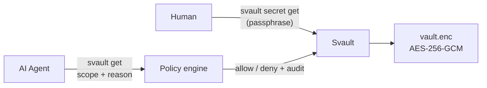
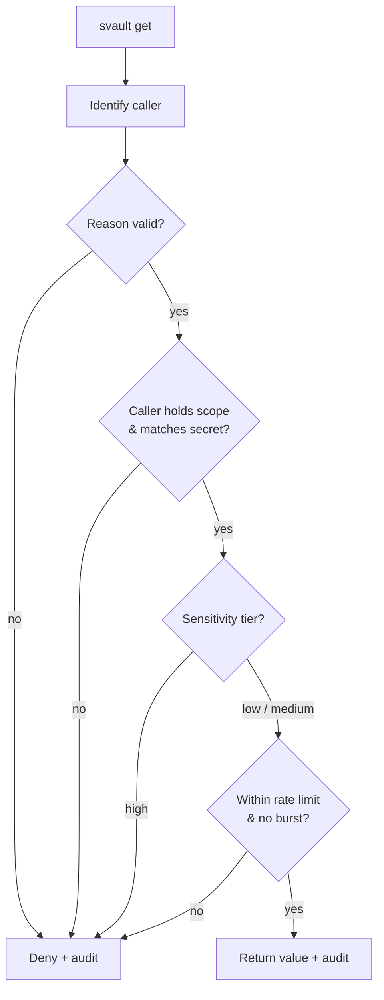
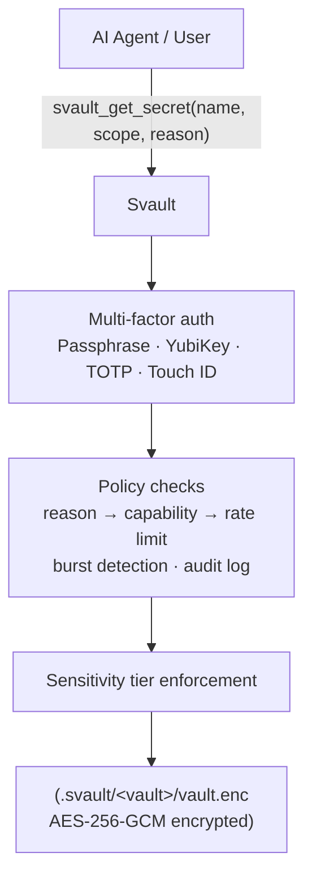

<div align="center">

# Svault

**The secret manager that knows an AI is asking.**

[](https://github.com/Soluzy/Svault/actions/workflows/lint.yml)
[](https://github.com/Soluzy/Svault/actions/workflows/ubuntu.yml)
[](https://github.com/Soluzy/Svault/actions/workflows/fedora.yml)
[](https://github.com/Soluzy/Svault/actions/workflows/macos.yml)
[](https://github.com/Soluzy/Svault/actions/workflows/windows.yml)

[](https://crates.io/crates/svault-ai)
[](https://crates.io/crates/svault-ai)
[](https://docs.rs/svault-ai)
[](LICENSE)
[](https://www.rust-lang.org)

</div>


Svault is an **AI-aware secret access layer** written in Rust. It sits between AI agents and your credentials — enforcing structured requests, detecting suspicious patterns, and making sure an agent has a real reason before it touches anything sensitive.

> **Why Svault?** Every existing secret manager (1Password, Infisical, HashiCorp Vault) treats an AI agent the same as a human or a script. Svault doesn't. It knows the difference.



---

## Documentation

| Guide | What's inside |
|---|---|
| [Installation](docs/installation.md) | crates.io, from source, supported platforms |
| [Interactive mode (TUI)](docs/tui.md) | The full-screen dashboard and keybindings |
| [Command reference](docs/commands.md) | Every subcommand and flag |
| [Policy engine](docs/policy-engine.md) | The agent path — `svault get`, scopes, tiers, audit |
| [Recovery & portability](docs/recovery.md) | Recovery code for a lost passphrase, export/import bundles |
| [Storage backends](docs/storage-backends.md) | Local today; cloud / self-hosted / S3 placeholders |
| [Security model](docs/security.md) | Crypto, memory safety, what's safe to commit |
| [Architecture](docs/architecture.md) | How it works, on-disk layout, auth methods |
| [Roadmap](docs/roadmap.md) | Where Svault is headed |
| [Changelog](CHANGELOG.md) | What's shipped, version by version |

---

## Quick start

```bash
# Install
cargo install svault-ai

# 1. Create an encrypted vault (interactive: storage, name, agents, auto-lock, passphrase…)
#    Prints a one-time recovery code — save it (see 'svault recover').
svault create

# 2. Add secrets
svault secret add DB_URL
svault secret add API_KEY

# 3. Unlock for your session (passphrase cached, not prompted again)
svault unlock

# 4. Use secrets without re-entering the passphrase
svault secret get DB_URL
svault secret list

# 5. Lock when done
svault lock
```

Or just run `svault` with no arguments for the [interactive TUI](docs/tui.md).

<div align="center">

⭐ **Star us if you like the project!**

</div>

---

<details>
<summary><b>Interactive mode (TUI)</b></summary>

<br>

Run `svault` with no subcommand to open the full-screen terminal UI:

```bash
svault
```

Browse all vaults (with live lock state), `c` create, `u` unlock / `l` lock, `s` edit settings, and — once a vault is unlocked — `a` add, view, and `d` delete secrets. The TUI reuses the cached session passphrase, so an unlocked vault is never re-prompted. Every subcommand still works for scripting.

**Full keybindings → [docs/tui.md](docs/tui.md)**

</details>

<details>
<summary><b>Policy engine — the agent path</b></summary>

<br>

`svault secret get` is the **human path** — passphrase, no questions asked. `svault get` is the **agent path**: a structured request that an AI must justify.

```bash
svault get DB_URL --scope database --reason "run nightly migration" --caller claude-code
```



Policy lives in a committable `svault.policy.yaml` (no secrets inside). `high`-tier secrets are never handed to an agent.

**Full pipeline, YAML schema, tiers → [docs/policy-engine.md](docs/policy-engine.md)**

</details>

<details>
<summary><b>Recovery & portability</b></summary>

<br>

`svault create` prints a one-time **recovery code** — a 160-bit second key that resets a lost passphrase. It's shown once and never stored in plaintext; keep it in a password manager.

```bash
svault recover                       # enter the code, set a new passphrase
svault export myvault --out vault.json   # portable, checksummed encrypted bundle
svault import vault.json                 # restore on another machine
```

The bundle carries no machine-specific state and every byte is encrypted or signed — safe to move between machines (same major Svault version).

**Recovery code + export/import → [docs/recovery.md](docs/recovery.md)**

</details>

<details>
<summary><b>Storage backends</b></summary>

<br>

| Backend | Status |
|---|---|
| `local` | Available (default) |
| `cloud` | Coming soon — Soluzy SaaS |
| `self-hosted` | Coming soon — your own server |
| `s3` | Coming soon — S3 / MinIO |

The chosen backend is recorded in `meta.yaml` and shown as a `storage:name` prefix everywhere a vault is listed. Vault names must be unique.

**Details → [docs/storage-backends.md](docs/storage-backends.md)**

</details>

<details>
<summary><b>Security model</b></summary>

<br>

| Property | Implementation |
|---|---|
| Encryption | AES-256-GCM |
| Key derivation | Argon2id (64 MB, 3 iterations) — GPU-resistant |
| Metadata integrity | HMAC-SHA256 — tampering with `meta.yaml` is detected |
| Memory safety | `VaultKey` + secrets derive `ZeroizeOnDrop` — wiped on drop |
| Session file | Atomic write, mode `0600` |
| Vault file | Safe to commit — encrypted at rest |

**The passphrase is the only key.**

**Threat model + on-disk layout → [docs/security.md](docs/security.md)**

</details>

<details>
<summary><b>Architecture</b></summary>

<br>



**Auth methods, full layout → [docs/architecture.md](docs/architecture.md)**

</details>

---

## Roadmap

| Phase | Status | What |
|---|---|---|
| **Step 1** | Done | Local encrypted vault — AES-256-GCM + Argon2id |
| **Step 1+** | Done | Interactive Ratatui TUI — forms, browsers, lock-aware secrets |
| **Step 2** | Done | Policy engine — caller identity, `reason`, scopes, tiers, rate limit, audit log |
| **Step 3** | In progress | Recovery (code + export/import) shipped; daemon next. Extra auth methods (YubiKey, TOTP, Touch ID/Face ID) deferred |
| **Step 4** | Planned | Desktop GUI (Tauri) + system tray |
| **Step 5** | Planned | MCP integration — Claude Code, Cursor, Copilot, VS Code, Aider |
| **Cloud** | Planned | Anomaly scoring via Claude Haiku — free tier + premium plans |

**Full roadmap → [docs/roadmap.md](docs/roadmap.md)**

---

## Tests

```bash
cargo test
```

49 tests covering: roundtrip encryption, wrong-key rejection, bit-flip authentication failure, distinct salts → distinct keys, key-from-bytes roundtrip, vault create/open, open-with-key, re-key, wrong passphrase, add/get/list/remove, persistence across reopen, tampered `vault.enc` rejected, tampered `meta.yaml` rejected, session unlock/lock/lock-all, passphrase strength checks, audit record/read, rate-limit parsing, the policy engine (capability, tiers, rate limit, burst, unknown caller, fallback mode), recovery code write/unlock + wrong-code rejection, full recover-and-rekey roundtrip (old passphrase rejected, secret preserved, code still valid), export-bundle checksum integrity, build→import recreating an openable vault + overwrite rejection, and storage-backend metadata roundtrip.

CI runs the suite on **Ubuntu, Fedora, macOS, and Windows** on every push and pull request.

---

## License

Apache 2.0 — see [LICENSE](LICENSE).

Built by [Soluzy](https://soluzy.ro).
