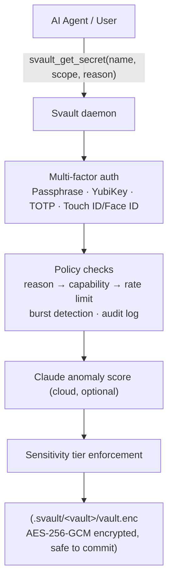

# Architecture

## How it works



The `reason` field is required by the [policy engine](policy-engine.md). An AI that cannot explain why it needs a secret is refused immediately.

## On-disk layout

```
.svault/
  my-project/
    vault.enc     ← AES-256-GCM encrypted secrets        (safe to commit)
    meta.yaml     ← name, storage backend, description,
                    access rules                          (safe to commit, HMAC-signed)
    .gitignore    ← auto-written at create; blocks .session + audit.log
    .session      ← passphrase cache while unlocked       (gitignored, mode 0600)
    audit.log     ← policy decisions for 'svault get'     (gitignored, mode 0600)
```

- **`vault.enc`** and **`meta.yaml`** are safe to commit — useless without the passphrase.
- **`.session`** is always gitignored and created with mode `0600` (owner read/write only).

## Authentication options

Choose any combination (Step 3+):

- **Passphrase** — always available, works everywhere.
- **YubiKey** — hardware HMAC-SHA1 challenge-response.
- **Google Authenticator** — time-based OTP (TOTP).
- **Touch ID / Face ID** — macOS biometric unlock.

| Method | UX | Security | Notes |
|---|---|---|---|
| Passphrase | Type passphrase | Strong if long | Always available, works anywhere |
| YubiKey | Touch key | Strong, hardware-backed | Fast daily use, requires YubiKey |
| Google Authenticator (TOTP) | Scan QR + enter 6-digit code | Medium-strong, time-based | Works on phone, no hardware needed |
| Touch ID / Face ID (macOS) | Fingerprint or face scan | Strong, biometric | Fastest unlock, macOS only |
| Passphrase + YubiKey | Touch + type | Strongest (2FA) | Hardware + knowledge, high-security vaults |
| Passphrase + TOTP | Type + enter code | Very strong (2FA) | No hardware needed |
| Passphrase + Touch ID | Type + biometric (macOS) | Very strong (2FA) | Fastest on Mac |
| Multi-select custom | User chooses methods at init | Configurable | Flexible per-vault posture |

See the [Security model](security.md) for the crypto guarantees behind each store.
