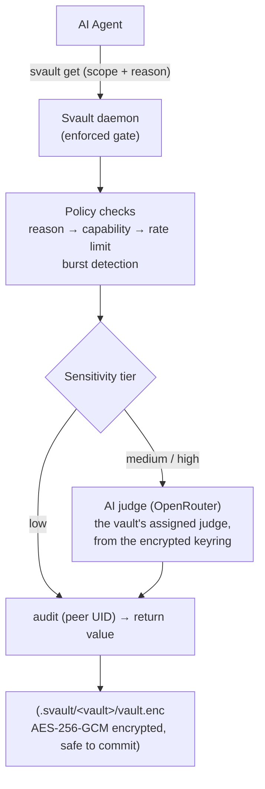

# Architecture

## How it works



This pipeline runs **inside the daemon** — the enforced choke point, not advisory —
and the CLI re-runs it locally when no daemon is up. The `reason` field is required
by the [policy engine](policy-engine.md); for medium- and high-tier secrets the
[AI judge](security.md#ai-judge) scores it. An AI that can't plausibly explain why
it needs a secret is refused. The whole policy surface — secret classification
(scope/tier), caller rules, access fallback, and the vault's judge assignment —
lives AES-256-GCM **encrypted inside `vault.enc`**, not in the plaintext
`meta.yaml`, so a same-UID agent can't read it at rest to plan a passing request.

There is no plaintext config file. All **global** config — the registry of **named
judges** (each with its own model, thresholds, free-text criteria, and API key)
plus operational knobs (lock timers, daemon max-connections, backend) — lives
AES-256-GCM **encrypted in `.svault/keyring.enc`**, opened by the **master
passphrase** (the keyring has a random data key wrapped under the master in
`.svault/keyring.keyslot.enc`, exactly like a vault) and unlocked once per session.
A vault is assigned a judge by name (encrypted in its policy) and falls back to the
keyring's default judge; the judge acts only when the keyring is unlocked, so until
then the static tier rules apply (high = human-only).

## On-disk layout

```
.svault/
  master.enc         ← master key wrapped under your master passphrase
                       (the unlock root for every vault)  (safe to commit, owner-only)
  .master.session    ← master-key cache while unlocked    (gitignored, mode 0600)
  keyring.enc        ← AES-256-GCM encrypted global config: the named-judge
                       registry (model/thresholds/criteria/API key each) +
                       operational knobs                  (safe to commit, owner-only)
  keyring.keyslot.enc ← the keyring's data key wrapped under
                       the master key                     (safe to commit, owner-only)
  .keyring.session   ← keyring data-key cache while unlocked (gitignored, mode 0600)
  usage.log          ← global judge changes, folded into vault timelines (gitignored, 0600)
  my-project/
    vault.enc     ← AES-256-GCM encrypted secrets + the
                    full policy surface (incl. judge
                    assignment)                           (safe to commit)
    keyslot.enc   ← this vault's data key wrapped under
                    the master key                        (safe to commit, owner-only)
    meta.yaml     ← name, storage backend, description,
                    settings (no policy)                  (safe to commit, HMAC-signed)
    recovery.enc  ← vault data key wrapped under the
                    recovery code                         (safe to commit)
    .gitignore    ← auto-written at create; blocks .session + logs
    .session      ← derived-key cache while unlocked      (gitignored, mode 0600)
    audit.log     ← policy decisions for 'svault get'     (gitignored, mode 0600)
    usage.log     ← activity timeline, human + agent       (gitignored, mode 0600)
```

- **`vault.enc`**, **`meta.yaml`**, **`keyslot.enc`**, **`master.enc`**, and **`recovery.enc`** are safe to commit — useless without the master passphrase or a recovery code. `keyslot.enc` wraps the vault's data key under the master key; `master.enc` wraps the master key under your passphrase. See [Recovery](recovery.md).
- **`keyring.enc`** is the single encrypted-at-rest store for global config (judges, their API keys, and operational knobs), opened by the **master passphrase** — its data key is wrapped under the master in `keyring.keyslot.enc`, exactly like a vault. It's useless without the master; the per-judge keys and criteria are unreadable at rest.
- **`.session`**, **`.keyring.session`**, **`audit.log`**, and **`usage.log`** are always gitignored and created with mode `0600` (owner read/write only). The per-vault `.gitignore` is self-healing — recording the first usage event adds any missing log lines, so vaults created before usage logging are covered too.
- **`usage.log`** is the activity stream behind the TUI `v` view: who did what, when, and through which surface (the `source`: `cli` / `tui` / `gui` / `mcp`) — human vs agent via the actor, never any secret value. Actor + source distinguish e.g. a human at the CLI from an agent via MCP. `audit.log` carries the same `source` field. See [Interactive mode](tui.md#activity-timeline).

## Authentication: the keyslot model

Every store — each vault **and the keyring** — is encrypted by a **random data
key**, not by your passphrase. That data key is wrapped in one or more
**keyslots**, and **any one slot opens the store** — it's "this *or* that", never a
two-step 2FA. Today there are two slots:

- **Master passphrase** *(today)* — one passphrase wraps a master key, which in
  turn wraps every store's data key (every vault and the keyring). Set once; it
  unlocks everything. This replaced the old per-vault passphrases and, as of
  0.9.5, the keyring's separate passphrase.
- **Recovery code** *(today)* — a 160-bit code generated at create, an
  equal-strength second slot into a single vault; use it if you lose the master
  (see [Recovery](recovery.md)).

Planned additional keyslots — each is purely additive (no data is re-encrypted),
and any one still opens the store on its own:

- **YubiKey** — hardware HMAC-SHA1 challenge-response *(next, 0.9.6)*.
- **Google Authenticator (TOTP)** / **Touch ID / Face ID** *(planned)*.

| Slot | UX | Security | Notes |
|---|---|---|---|
| Master passphrase | Type once | Strong if long | Unlocks every vault and the keyring; always available |
| Recovery code | Paste the saved code | Equal-strength (160-bit) | Per-vault fallback if the master is lost |
| YubiKey *(next)* | Touch the key | Strong, hardware-backed | An alternative slot — touch instead of typing |
| TOTP / Touch ID *(planned)* | Code / biometric | Medium–strong | Extra alternatives, no 2FA requirement |

See the [Security model](security.md) for the crypto guarantees behind each store.
