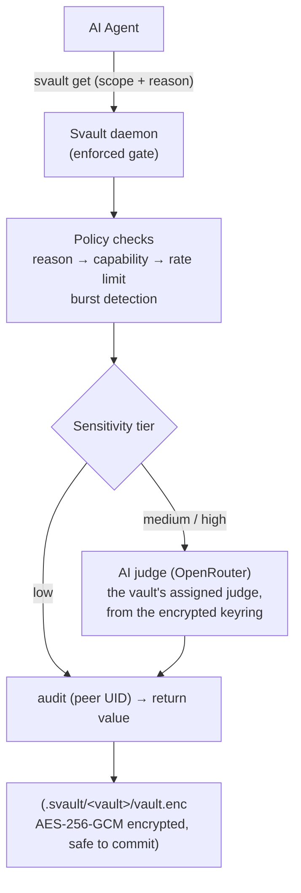

# Architecture

## How it works



Agents reach this gate through the **MCP server** (`svault mcp`); the `svault get`
CLI command runs the identical gate but is **deprecated** (it prints a deprecation
note to stderr and will be removed). This pipeline runs **inside the daemon** — the
enforced choke point, not advisory —
and the CLI re-runs it locally when no daemon is up. The `reason` field is required
by the [policy engine](policy-engine.md); for medium- and high-tier secrets the
[AI judge](security.md#ai-judge) scores it. An AI that can't plausibly explain why
it needs a secret is refused. The whole policy surface — secret classification
(scope/tier), caller rules, access fallback, and the vault's judge assignment —
lives AES-256-GCM **encrypted inside `vault.enc`**, not in the plaintext
`meta.yaml`, so a same-UID agent can't read it at rest to plan a passing request.

There is no plaintext config file. All **global** config — the registry of **named
judges** (each with its own model, thresholds, free-text criteria, and API key)
plus operational knobs (lock timers, daemon max-connections, backend) — lives
AES-256-GCM **encrypted in `.svault/keyring.enc`**, opened by the **master
passphrase** (the keyring has a random data key wrapped under the master in
`.svault/keyring.keyslot.enc`, exactly like a vault) and unlocked once per session.
A vault is assigned a judge by name (encrypted in its policy) and falls back to the
keyring's default judge; the judge acts only when the keyring is unlocked, so until
then the static tier rules apply (high = human-only).

## On-disk layout

The store lives at `~/.svault` by default — an installed `svault` resolves it
under your home directory regardless of the current working directory (including
the `svault mcp` server, whose CWD the MCP host chooses). Set `SVAULT_HOME` to
override the base directory; the store then lives at `$SVAULT_HOME/.svault`.

```
.svault/
  master.enc         ← master key wrapped under your master passphrase
                       (the unlock root for every vault)  (safe to commit, owner-only)
  master.recovery.enc ← master key wrapped under the one-time master recovery
                       code (reset a forgotten master)    (safe to commit, owner-only)
  master.yubikey.enc ← master key wrapped under a YubiKey (FIDO2 hmac-secret),
                       if one is enrolled                 (safe to commit, owner-only)
  master.yubikey.meta ← non-secret FIDO2 credential id + salt for that slot (owner-only)
  .master.session    ← master-key cache while unlocked, expires after 6h
                       (gitignored, mode 0600)
  keyring.enc        ← AES-256-GCM encrypted global config: the named-judge
                       registry (model/thresholds/criteria/API key each) +
                       operational knobs                  (safe to commit, owner-only)
  keyring.keyslot.enc ← the keyring's data key wrapped under
                       the master key                     (safe to commit, owner-only)
  .keyring.session   ← keyring data-key cache while unlocked (gitignored, mode 0600)
  usage.log          ← global judge changes, folded into vault timelines (gitignored, 0600)
  my-project/
    vault.enc     ← AES-256-GCM encrypted secrets + the
                    full policy surface (incl. judge
                    assignment)                           (safe to commit)
    keyslot.enc   ← this vault's data key wrapped under
                    the master key                        (safe to commit, owner-only)
    meta.yaml     ← name, storage backend, description,
                    settings (no policy)                  (safe to commit, HMAC-signed)
    recovery.enc  ← vault data key wrapped under the
                    recovery code                         (safe to commit)
    .gitignore    ← auto-written at create; blocks .session + logs
    .session      ← derived-key cache while unlocked      (gitignored, mode 0600)
    audit.log     ← policy decisions for 'svault get'     (gitignored, mode 0600)
    usage.log     ← activity timeline, human + agent       (gitignored, mode 0600)
```

- **`vault.enc`**, **`meta.yaml`**, **`keyslot.enc`**, **`master.enc`**, and **`recovery.enc`** are safe to commit — useless without the master passphrase or a recovery code. `keyslot.enc` wraps the vault's data key under the master key; `master.enc` wraps the master key under your passphrase. See [Recovery](recovery.md).
- **`keyring.enc`** is the single encrypted-at-rest store for global config (judges, their API keys, and operational knobs), opened by the **master passphrase** — its data key is wrapped under the master in `keyring.keyslot.enc`, exactly like a vault. It's useless without the master; the per-judge keys and criteria are unreadable at rest.
- **`.session`**, **`.keyring.session`**, **`audit.log`**, and **`usage.log`** are always gitignored and created with mode `0600` (owner read/write only). The per-vault `.gitignore` is self-healing — recording the first usage event adds any missing log lines, so vaults created before usage logging are covered too.
- **`usage.log`** is the activity stream behind the TUI `v` view: who did what, when, and through which surface (the `source`: `cli` / `tui` / `gui` / `mcp`) — human vs agent via the actor, never any secret value. Actor + source distinguish e.g. a human at the CLI from an agent via MCP. `audit.log` carries the same `source` field. See [Interactive mode](tui.md#activity-timeline).

## Storage and vault naming

Every vault is stored **locally** — an encrypted vault on this machine. The location is recorded in `meta.yaml` as `storage: local` and shown as a `local:` prefix everywhere a vault is listed (`svault vaults`, `svault status`, the TUI):

```
local:my-project        unlocked   primary app secrets
local:shared-secrets    locked     team-wide credentials
```

The prefix keeps vault identity explicit and consistent across the CLI and TUI. **Vault names must be unique** — creating a second vault with a name already in use is rejected. `storage` is a required field on `meta.yaml`.

## Source layout

Svault is a library crate (`src/lib.rs`) with a thin `svault` binary (`src/main.rs`)
that just calls `cli::run()`. The source is split into a reusable **core** and the
**frontends** that drive it — a frontend never reimplements secret handling, it
calls into `core`.

```
src/
  lib.rs            pub mod core; daemon; tui; cli; mcp; gui;
  main.rs           fn main() { svault_ai::cli::run() }
  core/             frontend-agnostic engine — no dependency on any frontend
    crypto, secfile, passphrase, config, meta, master, recovery, keyring,
    vault, policy, judge, gate, audit, usage, session, portable, yubikey
  daemon/           Unix unlock daemon (mod.rs) + its client (client.rs)
  tui/              interactive Ratatui terminal UI (mod, ui, theme)
  cli/              the `svault` command-line frontend; exposes cli::run()
  mcp/              the local MCP server (`svault mcp`) — gated access for AI agents
  gui/              stub (the desktop GUI lives in the gui-app/ crate, see below)
```

The **desktop GUI** (roadmap 2.0.0) is a separate Tauri app crate at `gui-app/`
rather than a module under `src/`: `gui-app/src-tauri` path-depends on `svault-ai`
and exposes thin Tauri commands over the same `core` + `daemon`, so `tauri` never
becomes a dependency of the published library. It is still a `core`-driven
frontend in every sense — it just compiles as its own binary. The `src/gui/`
module remains a stub. See [docs/gui.md](gui.md).

Dependency direction is one-way: `core` depends on nothing above it; `daemon`,
`tui`, and `cli` depend on `core` (and `cli`/`tui` reach the daemon client); the
`gui-app/` crate depends on `core` + `daemon` the same way. Adding a frontend
means adding a sibling that consumes `core` — no churn in the existing layers. Note that the `core` module name shadows the std `core` crate; the
source uses `std` throughout, so reach the std crate with `::core` if ever needed.

## Authentication: the keyslot model

Every store — each vault **and the keyring** — is encrypted by a **random data
key**, not by your passphrase. That data key is wrapped in one or more
**keyslots**, and **any one slot opens the store** — it's "this *or* that", never a
two-step 2FA. Today there are four slots:

- **Master passphrase** *(today)* — one passphrase wraps a master key, which in
  turn wraps every store's data key (every vault and the keyring). Set once; it
  unlocks everything. This replaced the old per-vault passphrases and, as of
  0.9.5, the keyring's separate passphrase.
- **Master recovery code** *(today)* — a 160-bit code generated when the master
  is first set; it wraps the *master key*, so `svault master recover` resets a
  forgotten master passphrase and reopens every store at once.
- **Per-vault recovery code** *(today)* — a 160-bit code generated at create, an
  equal-strength second slot into a single vault; used by `svault recover` and to
  attach a vault on another machine via `import` (see [Recovery](recovery.md)).
- **YubiKey** *(today)* — a hardware slot over the master key via the **FIDO2
  hmac-secret** extension (touch, plus the YubiKey PIN if one is set). Enroll with
  `svault master yubikey enroll`; thereafter `svault unlock` (and the TUI) offer
  the key, and the master passphrase still works. It wraps the master key in
  `master.yubikey.enc`, so the one touch opens every store. Purely additive — no
  data is re-encrypted — and an *or*-slot, not a second factor.

Planned additional keyslots — each is purely additive (no data is re-encrypted),
and any one still opens the store on its own:

- **Google Authenticator (TOTP)** / **Touch ID / Face ID** *(planned)*.

| Slot | UX | Security | Notes |
|---|---|---|---|
| Master passphrase | Type once | Strong if long | Unlocks every vault and the keyring; always available |
| Master recovery code | Paste the saved code | Equal-strength (160-bit) | Resets a forgotten master; reopens every store |
| Per-vault recovery code | Paste the saved code | Equal-strength (160-bit) | Per-vault fallback + cross-machine import |
| YubiKey | Touch the key (+ PIN) | Strong, hardware-backed (FIDO2 hmac-secret) | An alternative slot — touch instead of typing; lose it and the passphrase/recovery code still open everything |
| TOTP / Touch ID *(planned)* | Code / biometric | Medium–strong | Extra alternatives, no 2FA requirement |

See the [Security model](security.md) for the crypto guarantees behind each store.
