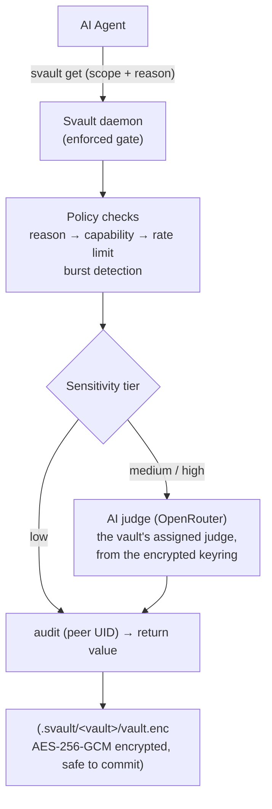

# Architecture

## How it works



This pipeline runs **inside the daemon** — the enforced choke point, not advisory —
and the CLI re-runs it locally when no daemon is up. The `reason` field is required
by the [policy engine](policy-engine.md); for medium- and high-tier secrets the
[AI judge](security.md#ai-judge) scores it. An AI that can't plausibly explain why
it needs a secret is refused. The whole policy surface — secret classification
(scope/tier), caller rules, access fallback, and the vault's judge assignment —
lives AES-256-GCM **encrypted inside `vault.enc`**, not in the plaintext
`meta.yaml`, so a same-UID agent can't read it at rest to plan a passing request.

There is no plaintext config file. All **global** config — the registry of **named
judges** (each with its own model, thresholds, free-text criteria, and API key)
plus operational knobs (lock timers, daemon max-connections, backend) — lives
AES-256-GCM **encrypted in `.svault/keyring.enc`** under its own passphrase,
unlocked once per session. A vault is assigned a judge by name (encrypted in its
policy) and falls back to the keyring's default judge; the judge acts only when the
keyring is unlocked, so until then the static tier rules apply (high = human-only).

## On-disk layout

```
.svault/
  keyring.enc        ← AES-256-GCM encrypted global config: the named-judge
                       registry (model/thresholds/criteria/API key each) +
                       operational knobs                  (safe to commit, owner-only)
  .keyring.session   ← keyring derived-key cache while unlocked (gitignored, mode 0600)
  usage.log          ← global judge changes, folded into vault timelines (gitignored, 0600)
  my-project/
    vault.enc     ← AES-256-GCM encrypted secrets + the
                    full policy surface (incl. judge
                    assignment)                           (safe to commit)
    meta.yaml     ← name, storage backend, description,
                    settings (no policy)                  (safe to commit, HMAC-signed)
    recovery.enc  ← vault key wrapped under the recovery
                    code                                  (safe to commit)
    .gitignore    ← auto-written at create; blocks .session + logs
    .session      ← derived-key cache while unlocked      (gitignored, mode 0600)
    audit.log     ← policy decisions for 'svault get'     (gitignored, mode 0600)
    usage.log     ← activity timeline, human + agent       (gitignored, mode 0600)
```

- **`vault.enc`**, **`meta.yaml`**, and **`recovery.enc`** are safe to commit — useless without the passphrase or recovery code. See [Recovery](recovery.md).
- **`keyring.enc`** is the single encrypted-at-rest store for global config (judges, their API keys, and operational knobs), unlocked under its own passphrase. Like a vault, it's useless without that passphrase; the per-judge keys and criteria are unreadable at rest.
- **`.session`**, **`.keyring.session`**, **`audit.log`**, and **`usage.log`** are always gitignored and created with mode `0600` (owner read/write only). The per-vault `.gitignore` is self-healing — recording the first usage event adds any missing log lines, so vaults created before usage logging are covered too.
- **`usage.log`** is the activity stream behind the TUI `v` view: who did what, when, and through which surface (the `source`: `cli` / `tui` / `gui` / `mcp`) — human vs agent via the actor, never any secret value. Actor + source distinguish e.g. a human at the CLI from an agent via MCP. `audit.log` carries the same `source` field. See [Interactive mode](tui.md#activity-timeline).

## Authentication options

Today a vault is unlocked by **passphrase**, with a **recovery code** as an equal-strength second key for a lost passphrase (see [Recovery](recovery.md)). The hardware and biometric methods below are **planned for a later step** — they are not wired yet:

- **Passphrase** — always available, works everywhere *(today)*.
- **Recovery code** — 160-bit code generated at create; resets a lost passphrase *(today)*.
- **YubiKey** — hardware HMAC-SHA1 challenge-response *(planned)*.
- **Google Authenticator** — time-based OTP (TOTP) *(planned)*.
- **Touch ID / Face ID** — macOS biometric unlock *(planned)*.

Planned method trade-offs:

| Method | UX | Security | Notes |
|---|---|---|---|
| Passphrase | Type passphrase | Strong if long | Always available, works anywhere |
| YubiKey | Touch key | Strong, hardware-backed | Fast daily use, requires YubiKey |
| Google Authenticator (TOTP) | Scan QR + enter 6-digit code | Medium-strong, time-based | Works on phone, no hardware needed |
| Touch ID / Face ID (macOS) | Fingerprint or face scan | Strong, biometric | Fastest unlock, macOS only |
| Passphrase + YubiKey | Touch + type | Strongest (2FA) | Hardware + knowledge, high-security vaults |
| Passphrase + TOTP | Type + enter code | Very strong (2FA) | No hardware needed |
| Passphrase + Touch ID | Type + biometric (macOS) | Very strong (2FA) | Fastest on Mac |
| Multi-select custom | User chooses methods at init | Configurable | Flexible per-vault posture |

See the [Security model](security.md) for the crypto guarantees behind each store.
