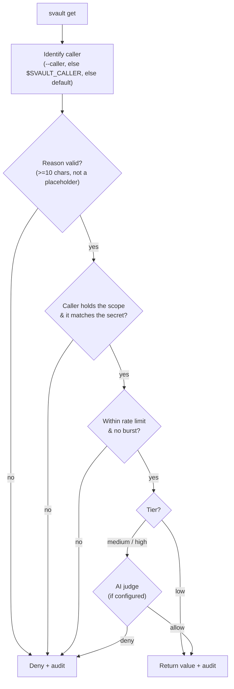

# Policy engine

This is what makes Svault *AI-aware*. There are two paths to a secret:

- **`svault secret get`** — the **human path**. Passphrase, no questions asked (audited).
- **`svault get`** — the **agent path**. A structured request an AI must justify, run through a pipeline — and, since 0.9.0, **enforced inside the daemon** so it can't be bypassed by talking to the socket directly.

## Enforced, not advisory (0.9.0)

The agent path is evaluated **where the key lives** — the daemon. `svault get`
sends a structured `GetGated` request; the daemon evaluates policy, consults the
AI judge for sensitive secrets, writes the audit record, and only then returns a
value. When no daemon is running, the CLI runs the **same** gate locally before
unlocking. There is no unguarded read path.

Every decision is audited and stamped with the connecting process's **peer UID**
(unforgeable), alongside the self-asserted `--caller` string.

> **Threat model.** This enforces the gate for cooperative and semi-trusted
> agents and gives a tamper-resistant audit trail plus behavioural detection. It
> is **not** a sandbox against a hostile *same-UID* process, which can read the
> daemon's memory directly — that boundary is documented in [security.md](security.md).

## Step-by-step: set up & change policy and the judge

A full setup is four moves. Each is independent — do only what you need, and
re-run any step later to change things.

> **Targeting a vault.** You can have several vaults (local today, remote
> planned), so every secret/get/settings command takes `-v <vault>` (`--vault`).
> Omit it only when there's a single vault, or to be prompted to pick one. The
> examples below add `-v billing` to be explicit.

### 1. Classify your secrets (scope + tier + description)

Classification lives in the signed `meta.yaml`. Set it when you add a secret, or
re-run `secret add` on an existing name to **reclassify** it (the value is
preserved if you leave it unchanged; the meta is re-signed). The optional
`--description` records *what the secret is for* — the AI judge weighs it against
the stated reason, so a request whose reason doesn't match the secret's purpose is
denied:

```bash
# Add and classify in one step (-v picks the vault)
svault secret add DB_PASSWORD -v billing --scope database --tier high \
  --description "production Postgres connection string"
svault secret add STRIPE_KEY  -v billing --scope payments --tier high --require-reason \
  --description "production Stripe charge key — only for billing/charge flows"
svault secret add ANALYTICS   -v billing --scope api --tier low

# Modify later — re-running with new flags updates the classification
svault secret add ANALYTICS   -v billing --scope api --tier medium \
  --description "read-only analytics API token"
```

Run `svault secret add NAME` with no flags to be prompted interactively for scope,
tier, and description (the tier defaults to the vault's `default_tier`). In the
TUI, `a` in the secret browser opens the same form (scope / description / tier /
require-reason). A `"*"` entry in the map is the default rule for any secret you
didn't classify. The vault's own description (set at `svault create` / in
settings) is also given to the judge as overall context.

### 2. Define who may ask (callers)

Callers live in the committable `svault.policy.yaml` (no secrets, no
classification). Scaffold it, then edit:

```bash
svault policy init          # writes svault.policy.yaml with a caller block
$EDITOR svault.policy.yaml  # add callers, scopes, rate limits (see below)
svault policy check claude-code   # verify what that caller can now reach
```

To **change** a caller's access, edit the file — discovery is anchored to the
project root and re-read on every request, so there's nothing to reload.

### 3. Turn on the AI judge (optional, for medium/high)

The judge is **off until a key is present**. Store an OpenRouter key, enable it,
and verify — no secret is touched:

```bash
svault judge set-key        # paste the key (hidden), or: echo "$KEY" | svault judge set-key
svault judge status         # confirm: key present + model/thresholds
# Dry-run — pass a realistic --vault and the descriptions to see how they sway it:
svault judge test --reason "run the nightly db migration" --scope database --tier high \
  --vault billing-api --vault-description "production billing service" \
  --description "production Postgres connection string"
```

Enable it for the machine in `.svault/config.yaml` (`judge.enabled: true`) or per
vault at `svault create` (and in TUI settings). **Change** the model/thresholds by
editing `[judge]` in that file; **rotate or remove** the key with `svault judge
set-key` again or `svault judge remove-key`.

### 4. Make a request as the agent

```bash
svault get DB_PASSWORD -v billing --scope database \
  --reason "run the nightly migration" --caller claude-code
```

Granted → the value prints to stdout (+ an audit row); denied → non-zero exit with
the reason. The judge sees the vault's and secret's descriptions, so the reason
has to fit what the secret is actually for. Review history any time with
`svault policy check <caller>`.

## The request pipeline

```bash
svault get DB_URL --scope database --reason "run nightly migration" --caller claude-code
```



On **allow**, the value is printed to stdout (status goes to stderr, so an agent
capturing stdout gets only the value). On **deny**, it exits non-zero and logs why.

## Sensitivity tiers

Each secret is classified in the vault's **signed `meta.yaml`** (see below). With
the AI judge **enabled**:

| Tier | Agent behaviour |
|---|---|
| `low` | Auto-allow (the judge is consulted only if the secret is `require_reason`) |
| `medium` | **Judge-gated.** Allowed if the judge scores >= the allow threshold. If the judge is unavailable: **fail-open**, audit-flagged `judge-unavailable` |
| `high` | **Judge-gated**, stricter threshold. If the judge is unavailable: **fail-closed** (deny) |

With the judge **disabled** (no key / `enabled = false`), it falls back to the
pre-0.9.0 rule: low/medium allowed (medium flagged), **high = human-only**.

## Per-secret classification (signed)

Classification lives in `meta.yaml`, which is HMAC-signed with the vault key — so
a same-UID attacker can't downgrade a tier or scope without the passphrase
(findings #5/#22). Set it when adding a secret:

```bash
svault secret add DB_PASSWORD --scope database --tier high --description "prod Postgres DSN"
svault secret add API_KEY      --scope api      --tier medium --require-reason
```

Each secret carries `scope`, `tier`, `require_reason`, and an optional
`description` (what it's for — passed to the AI judge as context). Interactively,
`svault secret add NAME` prompts for scope, tier (defaulting to the vault's
`default_tier`, chosen at `svault create`), and description. A `"*"` entry in the
classification map acts as the default for any unlisted secret.

## `svault.policy.yaml` — caller definitions

The committable policy file now holds **only the callers** (who may request which
scopes, and their rate limits) — it contains no secrets and no classification:

```yaml
version: 1
callers:
  claude-code:
    scopes: [database, api]
    rate_limit: 20/hour
  default:                 # applies to any unlisted caller
    scopes: []
    rate_limit: 5/hour
```

Discovery is **anchored to the project root** (the directory holding `.svault/`)
— Svault never searches above it (#5). A file that exists but fails to parse
**fails closed** (the request is denied), rather than silently falling back to
allow-all (N-2). With no policy file at all, caller authorization falls back to
the vault's `allow_agent` / `rate_limit` in `meta.yaml`.

## The AI judge

See [security.md](security.md#ai-judge) for setup. In short: store an OpenRouter
key with `svault judge set-key` (or set `$SVAULT_OPENROUTER_KEY`), enable the
judge in `.svault/config.yaml` (or per vault at create time), and the daemon will
score the `reason` on every medium/high request. Verify your setup without
touching a secret:

```bash
svault judge set-key                                                              # store the key 0600
svault judge test --reason "run the nightly database migration" --scope database --tier high
```

## Helper commands

- `svault policy init` — scaffold a `svault.policy.yaml` with the caller block.
- `svault policy check <caller>` — show a caller's scopes, the classified secrets it can reach (read from each vault's meta), its rate limit, and recent activity / denials.

Every request is appended to `.svault/<vault>/audit.log` (gitignored, mode `0600`).
