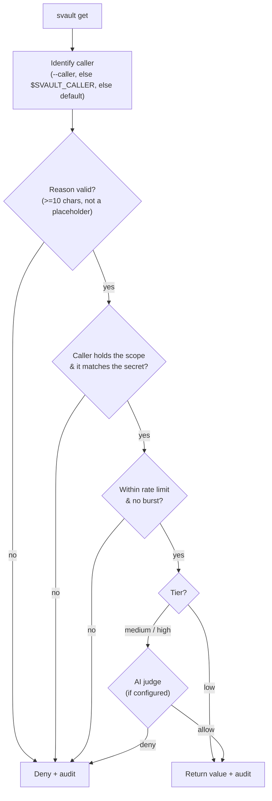

# Policy engine

This is what makes Svault *AI-aware*. There are two paths to a secret:

- **`svault secret get`** — the **human path**. Passphrase, no questions asked (audited).
- **`svault get`** — the **agent path**. A structured request an AI must justify, run through a pipeline — and, since 0.9.0, **enforced inside the daemon** so it can't be bypassed by talking to the socket directly.

## Enforced, not advisory (0.9.0)

The agent path is evaluated **where the key lives** — the daemon. `svault get`
sends a structured `GetGated` request; the daemon evaluates policy, consults the
AI judge for sensitive secrets, writes the audit record, and only then returns a
value. When no daemon is running, the CLI runs the **same** gate locally before
unlocking. There is no unguarded read path.

Every decision is audited and stamped with the connecting process's **peer UID**
(unforgeable), alongside the self-asserted `--caller` string.

> **Threat model.** This enforces the gate for cooperative and semi-trusted
> agents and gives a tamper-resistant audit trail plus behavioural detection. It
> is **not** a sandbox against a hostile *same-UID* process, which can read the
> daemon's memory directly — that boundary is documented in [security.md](security.md).

## The request pipeline

```bash
svault get DB_URL --scope database --reason "run nightly migration" --caller claude-code
```



On **allow**, the value is printed to stdout (status goes to stderr, so an agent
capturing stdout gets only the value). On **deny**, it exits non-zero and logs why.

## Sensitivity tiers

Each secret is classified in the vault's **signed `meta.yaml`** (see below). With
the AI judge **enabled**:

| Tier | Agent behaviour |
|---|---|
| `low` | Auto-allow (the judge is consulted only if the secret is `require_reason`) |
| `medium` | **Judge-gated.** Allowed if the judge scores >= the allow threshold. If the judge is unavailable: **fail-open**, audit-flagged `judge-unavailable` |
| `high` | **Judge-gated**, stricter threshold. If the judge is unavailable: **fail-closed** (deny) |

With the judge **disabled** (no key / `enabled = false`), it falls back to the
pre-0.9.0 rule: low/medium allowed (medium flagged), **high = human-only**.

## Per-secret classification (signed)

Classification lives in `meta.yaml`, which is HMAC-signed with the vault key — so
a same-UID attacker can't downgrade a tier or scope without the passphrase
(findings #5/#22). Set it when adding a secret:

```bash
svault secret add DB_PASSWORD --scope database --tier high
svault secret add API_KEY      --scope api      --tier medium --require-reason
```

Interactively, `svault secret add NAME` prompts for scope and tier (defaulting to
the vault's `default_tier`, chosen at `svault create`). A `"*"` entry in the
classification map acts as the default for any unlisted secret.

## `svault.policy.yaml` — caller definitions

The committable policy file now holds **only the callers** (who may request which
scopes, and their rate limits) — it contains no secrets and no classification:

```yaml
version: 1
callers:
  claude-code:
    scopes: [database, api]
    rate_limit: 20/hour
  default:                 # applies to any unlisted caller
    scopes: []
    rate_limit: 5/hour
```

Discovery is **anchored to the project root** (the directory holding `.svault/`)
— Svault never searches above it (#5). A file that exists but fails to parse
**fails closed** (the request is denied), rather than silently falling back to
allow-all (N-2). With no policy file at all, caller authorization falls back to
the vault's `allow_agent` / `rate_limit` in `meta.yaml`.

## The AI judge

See [security.md](security.md#ai-judge) for setup. In short: configure an
OpenRouter key (`$SVAULT_OPENROUTER_KEY` or a `0600` key file), enable the judge
in `.svault/config.yaml` (or per vault at create time), and the daemon will score
the `reason` on every medium/high request. Verify your setup without touching a
secret:

```bash
svault judge test --reason "run the nightly database migration" --scope database --tier high
```

## Helper commands

- `svault policy init` — scaffold a `svault.policy.yaml` with the caller block.
- `svault policy check <caller>` — show a caller's scopes, the classified secrets it can reach (read from each vault's meta), its rate limit, and recent activity / denials.

Every request is appended to `.svault/<vault>/audit.log` (gitignored, mode `0600`).
