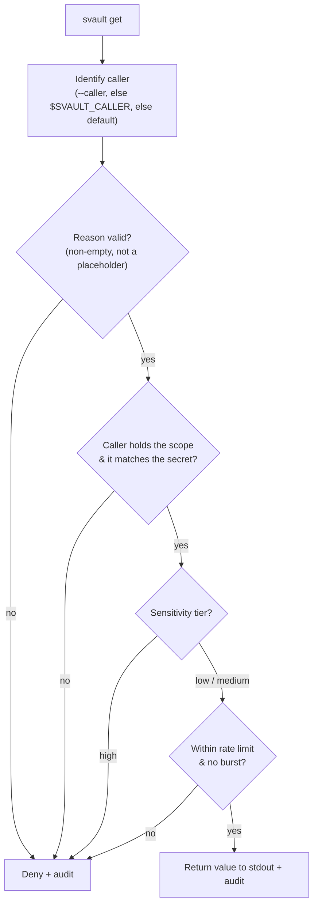

# Policy engine

This is what makes Svault *AI-aware*. There are two paths to a secret:

- **`svault secret get`** — the **human path**. Passphrase, no questions asked.
- **`svault get`** — the **agent path**. A structured request an AI must justify, run through a pipeline before any value is handed over.

## The request pipeline

```bash
svault get DB_URL --scope database --reason "run nightly migration" --caller claude-code
```



Every allow / deny is appended to the audit log — never the value.

On **allow**, the secret value is printed to stdout (status goes to stderr, so an agent capturing stdout gets only the value). On **deny**, it exits non-zero and logs why.

`high`-tier secrets are **never** handed to an agent — a human retrieves those with `svault secret get`.

## `svault.policy.yaml`

Policy lives in a single committable file at the project root. It holds **no secrets**:

```yaml
version: 1
callers:
  claude-code:
    scopes: [database, api]
    rate_limit: 20/hour
  default:                 # applies to any unlisted caller
    scopes: []
    rate_limit: 5/hour
vaults:
  my-project:
    secrets:
      DB_URL:      { scope: database, tier: low }
      DB_PASSWORD: { scope: database, tier: high }
      API_KEY:     { scope: api,      tier: medium }
      "*":         { scope: misc,     tier: medium }   # default for unlisted secrets
```

## Sensitivity tiers

| Tier | Agent behaviour |
|---|---|
| `low` | Auto-allow |
| `medium` | Allow, flagged as elevated in the audit log |
| `high` | Denied for agents — humans use `secret get` |

## Helper commands

- `svault policy init` — scaffold a `svault.policy.yaml` from your existing vault and secret names (all `tier: low`, scope `misc`) so you get a working starting point.
- `svault policy check <caller>` — show a caller's scopes, which secrets it can access, its rate limit, and recent activity / denials.

Every request is appended to `.svault/<vault>/audit.log` (gitignored, mode `0600`).

## No policy file?

`svault get` falls back to the vault's `meta.yaml` `allow_agent` / `rate_limit` settings (a reason is still required), and treats all secrets as `low`. The policy file is therefore **optional but recommended**.
